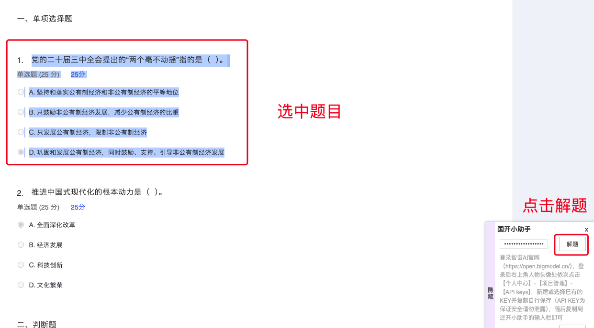

# 国开小助手

## 免责声明

此工具仅用于开发者交流学习之用，请勿用于其他场景，包括但不限于禁止商用、禁止售卖盈利等非法行为，若产生任何问题，作者不承担任何责任。

## 功能介绍

**新增：AI解题**，具体使用方法在下方查看

1. **视频后台播放：**部分视频在播放时，如果脱离焦点后，则会自动暂停。开次此功能，将解除这部分限制。
2. **结束自动切换：**开启后，在视频播放完完成后，则会自动切换当前目录级的下一个视频
3. **目录自动切换：**开启此功能则需要同时开启【结束自动切换】，若当前目录级下的视频全部播放结束，则会根据之后未展开的章节寻找下一个视频。若开启此功能，请勿手动点击目录结构。
4. **倍速：**调整视频倍速，1-16倍，切换视频后仍会保持所设置倍速。
5. **音量：**调整视频音量，0-100%，切换视频后仍会保持所设置音量。
6. **解除粘贴限制：**此功能用于某些答题功能，一些页面可能答题可能会导致粘贴无效，开启此功能则解除此限制。

## 使用环境

此程序为浏览器插件，市面常见的Chrome内核浏览器均支持，推荐使用Chrome浏览器。

## 安装方法
> 以Chrome浏览器为例，其他浏览器方法类似，可自行查询【***浏览器如何安装插件】

1. 打开Chrome，点击浏览器右上角【三个点】的图标，依次点击【扩展程序】【管理扩展程序】
2. 打开页面右上角的【开发者模式】
3. 点击页面左边的【加载已解压的扩展程序】，选择压缩包内的【package】文件夹后点击确定
4. 此时如果显示了【国开小助手】，证明安装成功

## 使用方法

进入国开的学习网的视频课学习界面后，在页面内点击鼠标右键，再点击【启动国开小助手】，如果启动成功，在页面的右下角就会显示小助手的页面

## AI解题使用方法

1. 打开智谱AI官网（https://open.bigmodel.cn/）
2. 登录后右上角人物头像处依次点击【个人中心】-【项目管理】-【API keys】
3. 新建或选择已有的KEY并复制自行保存（API KEY为保证安全请勿泄露）
4. 国开进入答题页面，在页面内点击鼠标右键，再点击【启动国开小助手】，如果启动成功，在页面的右下角就会显示小助手的页面
5. 把复制的KEY粘贴到国开小助手的输入栏
6. 鼠标选中整个题目，包括题目和选项，点击解题等待即可

**建议一题一题的AI解答，不要一次选中多个题目**

## 开源许可证

**GNU General Public License v3.0**

